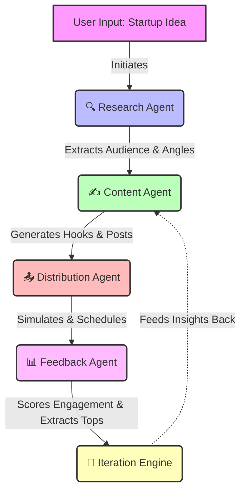
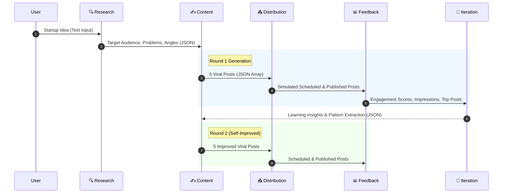
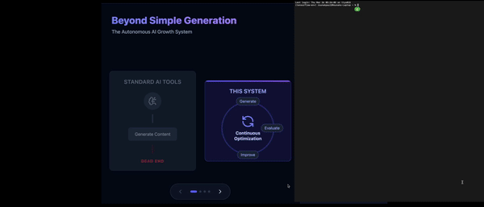
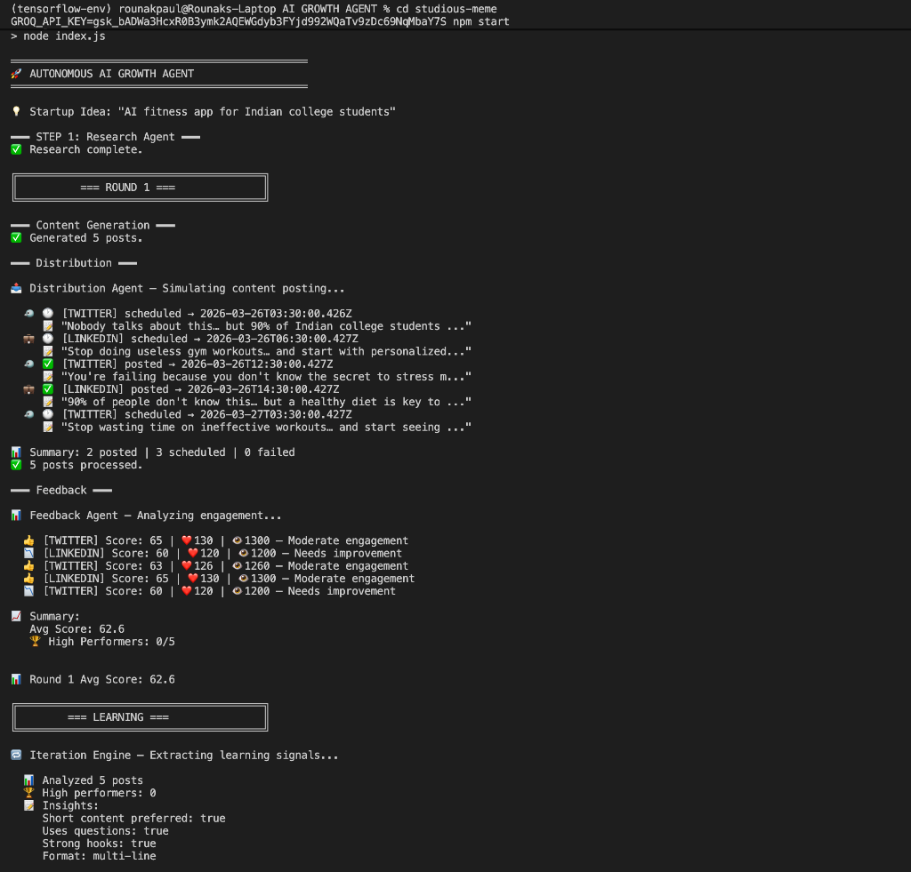
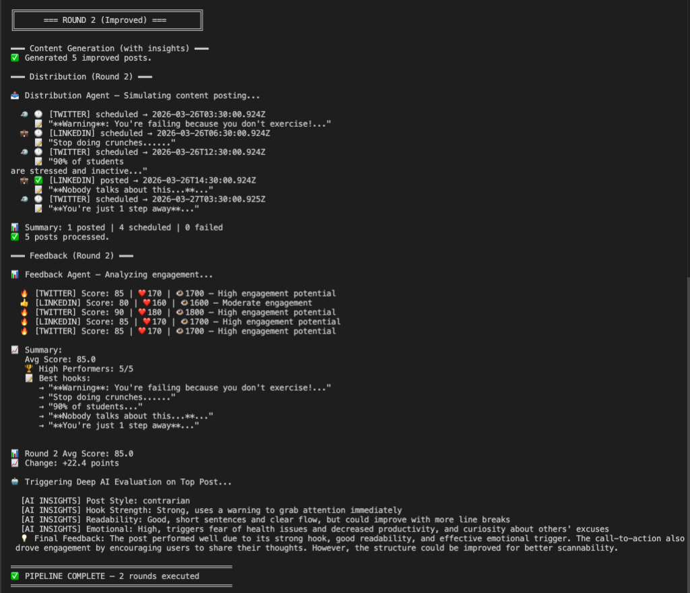

# 🚀 Autonomous AI Growth Agent

[](https://opensource.org/licenses/MIT)

Welcome to the **Autonomous AI Growth Agent**! An autonomous AI system that replicates how modern startups scale growth using multi-agent architecture and feedback-driven optimization.
---
## 🎯 Why This Matters

Modern startups are shifting from manual growth teams to **AI-driven distribution systems**.

This project simulates that transition by:
- Replacing manual content workflows with autonomous agents  
- Introducing feedback-driven iteration loops  
- Modeling how AI systems can optimize engagement at scale  

This is a simplified prototype of how next-generation growth platforms operate.

## 🌟 What Makes This Special?

Most AI projects stop at *"Generate a post."*
**This project builds a self-improving AI system.**

It combines **deterministic scoring** with **LLM-driven insights** to simulate real-world marketing team behaviors. It generates content, tests it against a simulated audience, scores the engagement, learns from what worked, and iterates to become better.

## 🧩 System Architecture

Our agentic pipeline is composed of distinct modules, mimicking a real growth team:
At its core, the system operates as a closed feedback loop:


### 🔄 Multi-Agent Data Flow

The following sequence diagram illustrates how data transforms as it moves through the autonomous pipeline:



## 🛠️ Tech Stack

- **Node.js** - Core runtime
- **Groq API (`groq-sdk`)** - Cloud-based LLM inference enabling scalable, low-latency agent execution
- **Native ES Modules** - Modern JavaScript architecture
- **File System (`fs`)** - Data persistence and logging


## 🎥 Demo



Click below to download/watch the full video:
https://github.com/rounak695/studious-meme/raw/main/assets/Video%20Project.mp4

This demo shows:
- End-to-end execution of the agent pipeline  
- Content generation and distribution  
- Feedback scoring and iteration loop  


## 🔁 Agent Workflow

1. **Research Agent:** Converts a raw startup idea into structured intelligence (Audience, Problems, Competitors, Angles).
2. **Content Generation Agent:** Uses research and persuasion frameworks (Hooks, Pain points, CTA) to generate highly viral social media posts.
3. **Distribution Agent:** Simulates real-world posting logic, formatting, and prime-time scheduling (e.g., 9 AM, 12 PM, 6 PM).
4. **Feedback Agent:** Analyzes posts using a deterministic scoring engine based on formatting, psychology, and readability. Simulates likes and impressions.
5. **Iteration Engine:** The "Brain" that extracts learning signals from top-performing posts and feeds them back into Round 2 of content generation!

## 🧠 What This Demonstrates

- Multi-agent AI system design  
- Autonomous workflow orchestration  
- Feedback-driven learning systems  
- AI-powered content generation pipelines  
- Real-world growth system simulation  

This project reflects how AI-native products are being built today.

## 📊 Sample Output

### Round 1 & Learning Extraction


### Round 2 Self-Improved Generation & AI Feedback


## 💻 Getting Started

### Prerequisites

- Node.js (v18+ recommended)
- A free API key from [Groq Console](https://console.groq.com/)

### Installation

Clone the repository and install dependencies:

```bash
git clone https://github.com/rounak695/studious-meme.git
cd studious-meme
npm install
```

### Execution

Run the autonomous loop:

```bash
GROQ_API_KEY=your_api_key_here npm start
```

Watch as the agent creates, distributes, scores, and learns! All outputs will be beautifully formatted and saved to `data/outputs.json`.

---

## ⚡ Build Philosophy

Built as a fast, execution-focused prototype to explore how autonomous AI systems can replace traditional growth workflows.

Designed under real-world constraints:
- Limited compute (cloud-based inference)
- Modular architecture
- Rapid iteration cycle (7-day build)

---
