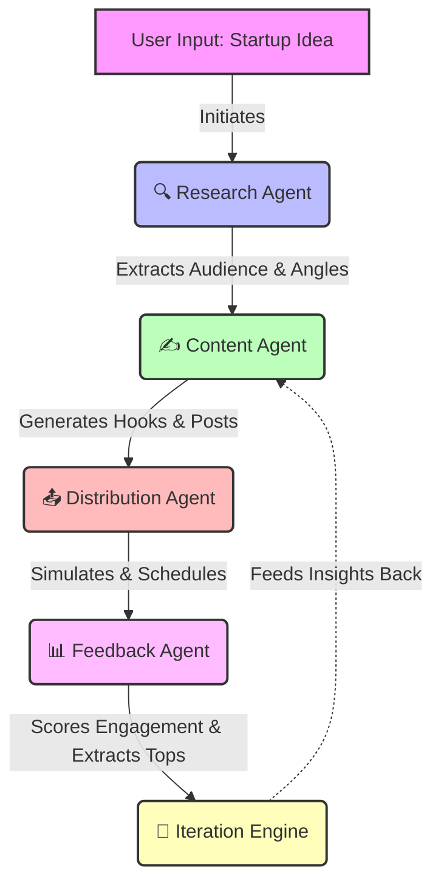

# 🚀 Autonomous AI Growth Agent

[](https://opensource.org/licenses/MIT)

Welcome to the **Autonomous AI Growth Agent**! This is a state-of-the-art, multi-agent simulation engine designed to automate the entire lifecycle of startup growth marketing—from ideation to viral content generation, simulated distribution, engagement tracking, and self-improving feedback loops.

---

## 🌟 What Makes This Special?

Most AI projects stop at *"Generate a post."*
**This project builds a Learning System!**

It combines **deterministic scoring** with **LLM-driven insights** to simulate real-world marketing team behaviors. It generates content, tests it against a simulated audience, scores the engagement, learns from what worked, and iterates to become better.

## 🧩 System Architecture

Our agentic pipeline is composed of distinct modules, mimicking a real growth team:



## 🛠️ Tech Stack

- **Node.js** - Core runtime
- **Groq API (`groq-sdk`)** - Lightning-fast cloud LLM inference using `llama-3.3-70b-versatile`
- **Native ES Modules** - Modern JavaScript architecture
- **File System (`fs`)** - Data persistence and logging

## 🚀 How It Works

1. **Research Agent:** Converts a raw startup idea into structured intelligence (Audience, Problems, Competitors, Angles).
2. **Content Generation Agent:** Uses research and persuasion frameworks (Hooks, Pain points, CTA) to generate highly viral social media posts.
3. **Distribution Agent:** Simulates real-world posting logic, formatting, and prime-time scheduling (e.g., 9 AM, 12 PM, 6 PM).
4. **Feedback Agent:** Analyzes posts using a deterministic scoring engine based on formatting, psychology, and readability. Simulates likes and impressions.
5. **Iteration Engine:** The "Brain" that extracts learning signals from top-performing posts and feeds them back into Round 2 of content generation!

## 💻 Getting Started

### Prerequisites

- Node.js (v18+ recommended)
- A free API key from [Groq Console](https://console.groq.com/)

### Installation

Clone the repository and install dependencies:

```bash
git clone https://github.com/rounak695/studious-meme.git
cd studious-meme
npm install
```

### Execution

Run the autonomous loop:

```bash
GROQ_API_KEY=your_api_key_here npm start
```

Watch as the agent creates, distributes, scores, and learns! All outputs will be beautifully formatted and saved to `data/outputs.json`.

---
*Built with ❤️ for modern AI-native growth hackers.*
